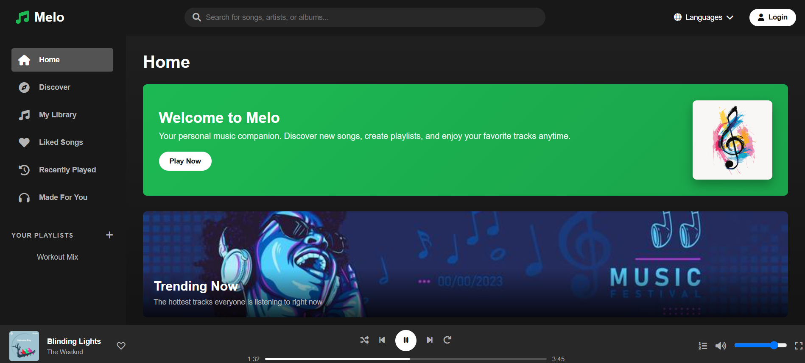

# Melo Music Player 🎵



Melo is a modern, responsive web-based music player with a sleek UI inspired by popular streaming services. Enjoy your favorite tracks with a beautiful interface that works across all devices.

## Features ✨

- 🎧 **Music Player** - Play/pause, skip tracks, volume control, and progress bar
- 🔍 **Search** - Find songs, artists, or albums quickly
- 📚 **Library** - Browse your music collection by albums, artists, and playlists
- ❤️ **Liked Songs** - Save your favorite tracks in one place
- 🕒 **Recently Played** - Pick up where you left off
- 🎛️ **Custom Playlists** - Create and manage your own playlists
- 🌍 **Multi-language Support** - Choose from 12 music languages
- 🔄 **Responsive Design** - Works on desktop, tablet, and mobile

## Technologies Used 🛠️

- **Frontend**: HTML5, CSS3, JavaScript
- **Icons**: Font Awesome 6
- **Styling**: CSS Variables for theming
- **Responsive Design**: Media queries for all screen sizes

## Installation & Setup ⚙️

1. Clone the repository:
   ```bash
   git clone https://github.com/yourusername/melo-music-player.git
   ```
2. Navigate to the project directory:
   ```bash
   cd melo-music-player
   ```
3. Open `index.html` in your browser (no server required)

## Project Structure 📂

```
melo-music-player/
├── index.html          # Main application file
├── style.css           # All styling for the app
├── script.js           # All JavaScript functionality
|__ sidebar.html         
└── assets/             # (Optional) Folder for images/icons
```

## How to Use 🎶

1. **Browse Music**:
   - Navigate through Home, Discover, or Library sections
   - Click on any album or playlist to view tracks

2. **Play Music**:
   - Click on any song to start playback
   - Use player controls at the bottom:
     - Play/Pause ⏯️
     - Previous/Next ⏮️⏭️
     - Volume control 🔊
     - Progress bar 🎚️

3. **Manage Playlists**:
   - Click "+" in the sidebar to create new playlists
   - Add songs to playlists from the "Add Songs" section

## Customization 🎨

You can easily customize the app by modifying:

- **Colors**: Edit the CSS variables in `:root`
- **Content**: Update the `musicData` object in `script.js`
- **Layout**: Adjust the grid/flexbox settings in `style.css`

## Future Improvements 🚀

- [ ] Add actual audio playback functionality
- [ ] Implement user authentication
- [ ] Add database integration for persistent data
- [ ] Include more advanced player features (shuffle, repeat, etc.)
- [ ] Dark/light mode toggle

## Contributing 🤝

Contributions are welcome! Please fork the repository and submit a pull request with your improvements.

## License 📄

This project is licensed under the MIT License.

---
